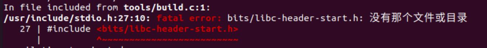
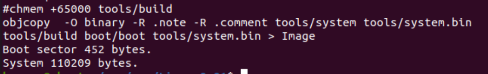
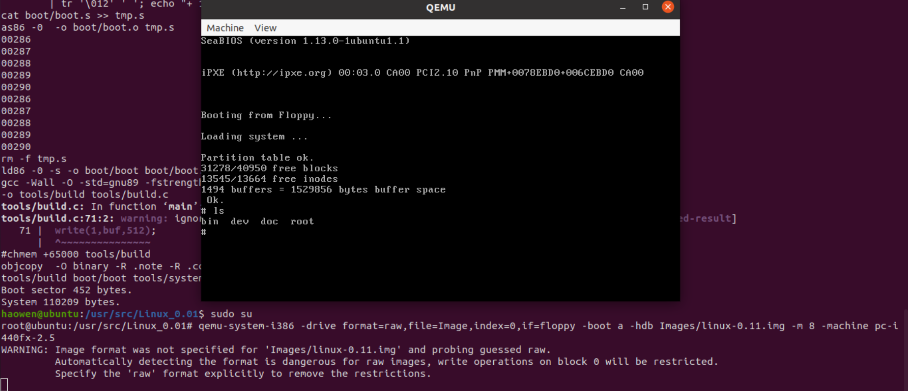

# 第一次作业 
- 马昊文 2022302111138

1. 首先下载Linux0.0.1内核，下载链接  https://github.com/mahadevvinay/Linux_0.01
2. 进入目录，运行 `patch -p1 < linux_0.01_Compilations_changes.patch`对一些文件进行修改以适应最新版本gcc
3. 对部分源码进行修改，包括所有Makefile文件, namei.c, console.c, hd.c  
**修改完成后，如果直接运行make，则会产生一个报错**

错误原因在于没有安装gcc-multilib，运行 `sudo apt-get install gcc-multilib`即可  
4. 执行make  
运行成功会显示如下信息
5. 运行qemu
	> qemu-system-i386 -drive format=raw, file=Image, index=0, if=floppy -boot a -hdb Images/linux-0.11.img -m 8 -machine pc-i440fx-2.5  

	运行成功即可进入虚拟机shell界面

## 可能存在的问题
操作系统环境可能对qemu的运行产生影响。在VMWare运行的ubuntu20.04下，qemu可正常运行。在腾讯云服务器上运行的ubuntu22.04不能正常运行qemu，会卡在booting from floppy。