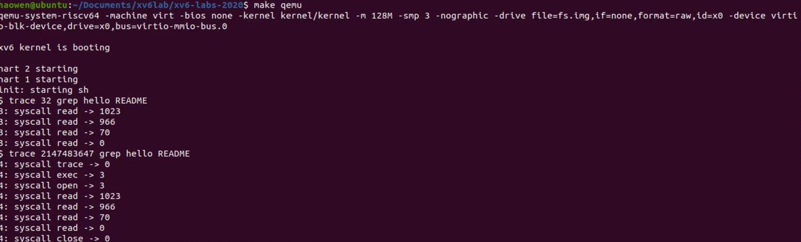

# 第二次作业 
- 马昊文 2022302111138

1. 目标： 在MIT XV6 lab2中，按照要求加入系统调用trace。它追踪指定进程的调用及其创建的子进程。
2. 流程： 
	- 先将trace的调用接口注册到指定位置(user.h和usys.pl)。其中，usys.pl以宏的形式调用注册的系统调用函数，直接使用ecall指令进入内核态。
	- 为proc.h中的proc添加trace所需的tracemask，在proc.c中的allocproc中初始化tracemask，并在fork中使子进程的tracemask继承父进程的tracemask。
	- 在sys_trace中，使用argint从寄存器中读取trace的第一个参数，并将新获取的bitmask并入当前进程的tracemask。
	
	- 最后，在syscall中添加trace的打印。
3. 运行结果： 
	- 

	- 
	- 最左边表示对应进程的pid，最右边表示返回值